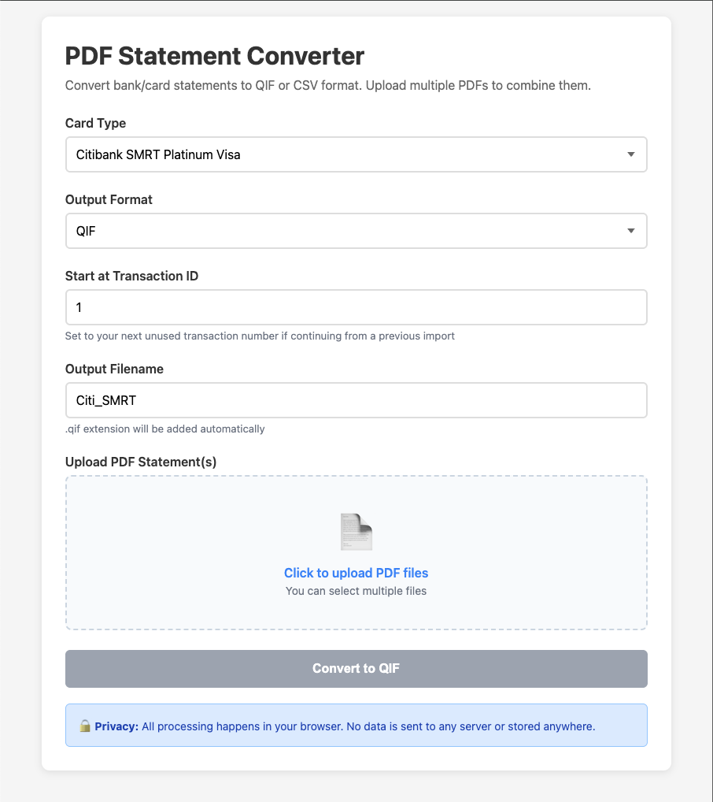

# PDF Statement Converter

**Convert Singapore bank and credit card statement PDFs to QIF or CSV — entirely in your browser.**

No installation. No server. No sign-up. No internet required. Your financial data never leaves your machine.



---

## Why This Tool?

Singapore banks don't export transactions in formats that personal finance software understands. Your options are usually manual entry, or online converters that upload your bank statements to a stranger's server.

This tool runs entirely in your browser. Drop in a PDF, get a QIF or CSV file back. Nothing is uploaded anywhere — ever.

## Supported Statements

### Credit Cards

| Bank | Card | Network | Status |
| ------ | ------ | ------- | ------ |
| Citibank | SMRT Platinum | Visa | ✅ |
| Citibank | Rewards World | Mastercard | ✅ |
| UOB | Absolute Cashback | AMEX | ✅ |
| UOB | PRVI Miles | Mastercard | ✅ |
| UOB | Preferred Platinum | Visa | ✅ |
| AMEX | KrisFlyer (Singapore Airlines) | AMEX | ✅ |
| Standard Chartered | Simply Cash | Mastercard | ✅ |
| Standard Chartered | Priority Banking Visa Infinite | Visa | ✅ |
| HSBC | Advance | Visa | ✅ ¹ |
| HSBC | Revolution | Visa | ✅ ¹ |

### Bank Accounts

| Bank | Accounts | Status |
| ------ | -------- | ------ |
| Standard Chartered | Bonus$aver, Unlimited$aver, Securities Settlement | ✅ |
| HSBC | Premier, Everyday Global | ✅ ¹ |

> ¹ HSBC statements are scanned images — requires OCR pre-processing. See below.

## Quick Start

1. Clone or download this repo
2. Open `index.html` in your browser — no server needed
3. Select your bank/card, upload your PDF statement(s), and click Convert
4. Download the QIF or CSV file

### Works with

- **Quicken** and **Quicken Finanzmanager**
- **MoneyMoney**
- Any personal finance software that imports QIF or CSV

### Pre-processing scanned PDFs (HSBC only)

HSBC statements are scanned images with no embedded text. Run `preprocess.sh` to add an OCR text layer before converting:

```bash
# Install once
brew install ocrmypdf

# Pre-process one or more statements
./preprocess.sh statement.pdf
./preprocess.sh ~/Downloads/hsbc/*.pdf
```

The script outputs `*_ocr.pdf` files alongside the originals. Upload those to the converter.

## Customizing Categories

Transactions are auto-categorized using keyword matching. The repo ships with sensible defaults — override them with your own merchant keywords.

1. Copy `categories.default.js` → `categories.personal.js`
2. Edit with your own keywords and category names
3. Reload `index.html` — your categories apply automatically

`categories.personal.js` is gitignored so your personal merchant data stays off GitHub.

```javascript
var CATEGORY_RULES = {
    'Food:Groceries': ['FAIRPRICE', 'COLD STORAGE', 'GIANT'],
    'Transport:Rideshare': ['GRAB', 'GOJEK'],
    // ...
};
```

- Keywords are **case-insensitive** and use **substring matching**
- First match wins — put specific keywords before generic ones
- Category names can use any format your accounting software supports

### GIRO payment transfers

When a credit card statement contains a GIRO payment line, categorize it with a bracket-notation transfer account — e.g. `[My HSBC Account]`. This tells Quicken/MoneyMoney that the payment is a transfer from that account, creating the matching entry on import automatically.

## File Structure

```text
pdf-statement-converter/
├── assets/
│   ├── screenshot.png         # README screenshot
│   ├── pdf.min.js             # PDF.js (bundled — no CDN dependency)
│   └── pdf.worker.min.js      # PDF.js worker (bundled)
├── index.html                 # HTML UI — open this in your browser
├── styles.css                 # Stylesheet
├── preprocess.sh              # OCR helper for scanned PDFs (HSBC)
├── categories.default.js      # Default English categories — committed
├── categories.personal.js     # Your personal categories — gitignored, local only
├── README.md                  # This file
├── ROADMAP.md                 # Planned features and development priorities
└── js/
    ├── utils.js               # Shared helpers
    ├── pdf.js                 # PDF text extraction (PDF.js wrapper)
    ├── export.js              # QIF and CSV generation
    ├── app.js                 # UI logic and conversion orchestration
    └── parsers/
        ├── citi.js            # Citibank parser
        ├── uob.js             # UOB parser
        ├── amex.js            # AMEX parser
        ├── sc.js              # Standard Chartered parser
        ├── hsbc.js            # HSBC parser
        └── registry.js        # Parser registry
```

## Privacy & Security

- **Zero server communication** — no APIs, no analytics, no tracking
- **No data storage** — nothing is saved to disk, localStorage, or cookies
- **Fully offline** — PDF.js is bundled locally; no CDN, no internet required after download
- **Open source** — inspect every line of code yourself

## Contributing

Contributions are welcome! See [ROADMAP.md](ROADMAP.md) for planned features.

### Adding a New Parser

1. Study your bank's PDF statement format (use the browser console to inspect extracted text)
2. Create `js/parsers/<bank>.js` following the pattern of an existing parser
3. Register it in `js/parsers/registry.js`
4. Add a `<script>` tag in `index.html` and the dropdown option + filename mapping in `js/app.js`
5. Submit a PR — no real statement data, just parser logic

## License

Licensed under the [PolyForm Noncommercial License 1.0.0](LICENSE). Free for personal, non-commercial use. For commercial licensing inquiries, please open an issue.
